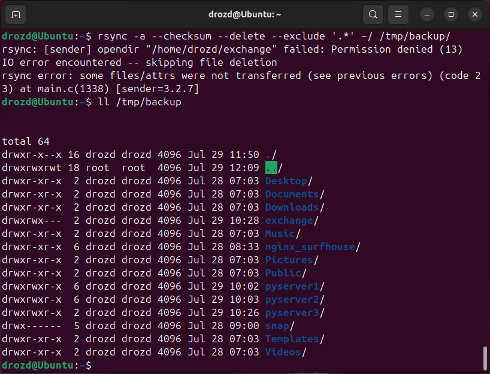
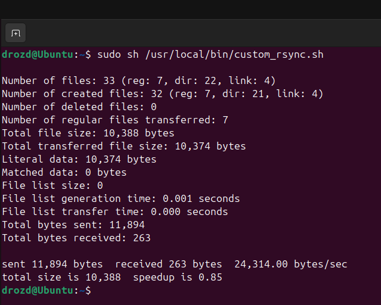

# Домашнее задание к занятию "`Резервное копирование`" - `Гривняшкин Роман`

---

### Задание 1

---

### Задание 2

`На скриншоте результат работы скрипта с выводом в консоль. Файл скрипта приложен`

[crontab](./crontab)
[script](./custom_rsync.sh)

